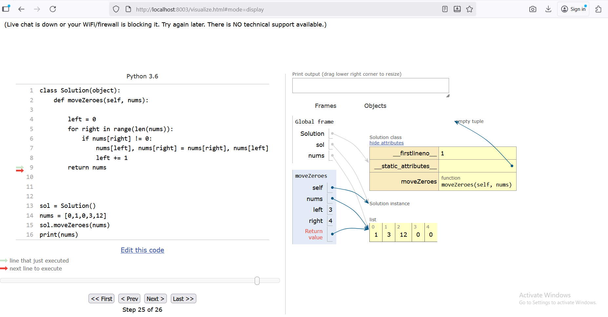

# 🐍 Online Python Tutor — Modern Python 3.14.0-Compatible Fork

**Online Python Tutor** helps people overcome a fundamental barrier to learning programming —  
understanding what happens as the computer executes each line of source code.

Using this tool, you can write and visualize **Python, Java, JavaScript, TypeScript, Ruby, C, and C++** programs directly in your browser, watching how the program executes step by step.

---

### 🧩 About This Fork

[](LICENSE)
[](https://github.com/pgbovine/OnlinePythonTutor)
[](https://github.com/GraceDuquiza)

This is a **modernized fork** of [sineagles/OnlinePythonTutor](https://github.com/sineagles/OnlinePythonTutor),  
which is based on the **original Online Python Tutor** created by [Philip Guo](http://pgbovine.net/) in 2010.

Maintained by **Grace Duquiza (2025)**, this version focuses on modern Python compatibility and security improvements.

🔧 **Updates include:**
- Replaced deprecated `imp` with `importlib`
- Fixed regex escape warnings
- Removed exposed API keys
- Added homepage redirect for `/ → /visualize.html`
- Verified compatibility with **Python 3.6 – 3.14**

> 💡 *Note:*  
> The UI may still display “Python 3.6,” but the backend works fully with **Python 3.14**.

---

### 🧩 Development Notes
This fork modernizes **Python Tutor v5-unity** for current systems, ensuring stable execution under Python 3.6–3.14 and simplifying local setup with the Bottle web server.

### ⚙️ Quick Start (Local Setup)

You can run the visualizer locally using **Python ≥ 3.6** and **Bottle**:


```
pip install bottle # make sure the bottle webserver (http://bottlepy.org/) is installed
cd OnlinePythonTutor/v5-unity/
python bottle_server.py
```


Then open in your browser:

- 🧮 **Visualizer:** [http://localhost:8003/](http://localhost:8003/)  

## 🖼️ Example Visualization

<p align="center">
  
  <br/>
  <em>Figure 1. Example of a generated Python Tutor visualization.</em>
</p>

⚠️ **Note:**  
The non-Python visualizers (Java, JS, C/C++) rely on external backends and may not run locally without additional configuration.  
By default, the local setup calls the original server for non-Python backends, so please be mindful of bandwidth usage.

---

### 🧠 Original Project Info

This project is based on [Philip Guo’s Online Python Tutor](https://github.com/pgbovine/OnlinePythonTutor),  
created in **2010** to help learners visualize code execution.

- [List of unsupported features and known bugs](https://github.com/pgbovine/OnlinePythonTutor/blob/master/unsupported-features.md)  
- [Developer Overview](v3/docs/developer-overview.md)  
- [Embedding HOWTO](v3/docs/embedding-HOWTO.md)

> 💡 The original repository is less actively maintained,  
> but this fork continues development and testing for new Python versions.

---

### ⚙️ Tech Stack

**Languages:** Python, Java, JavaScript, TypeScript, Ruby, C, C++  
**Frameworks & Tools:** Flask, Bottle, Node.js, D3.js  
**Tested Compatibility:** Python 3.6 → 3.14  
**Server:** Local Bottle web server (`bottle_server.py`)

---


### 🏆 Acknowledgments

**Original Author:** [Philip Guo](http://pgbovine.net/) — Creator of [Online Python Tutor](https://pythontutor.com/) (2010)  
**Previous Maintainer:** [sineagles](https://github.com/sineagles/OnlinePythonTutor) — Python 3-compatible fork  

This version is **maintained by Grace Duquiza (2025)** with improvements for  
Python 3.6–3.14 compatibility, security updates, and modernized local hosting.

Key contributors who helped shape earlier versions include:  
John DeNero, Irene Chen, Mark Liffiton, Brad Miller, Peter Wentworth, and many others.

> View the full contributor list in the  
> [sineagles/OnlinePythonTutor repository](https://github.com/sineagles/OnlinePythonTutor).


---

### 📜 License

This project retains the original **MIT License**.  
Copyright © Philip Guo & contributors.  
Fork maintained by Grace Duquiza (2025).

